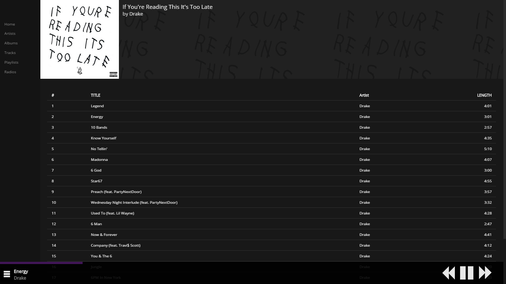
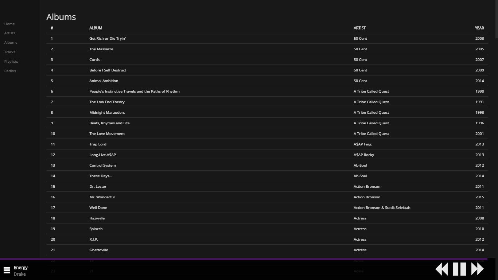
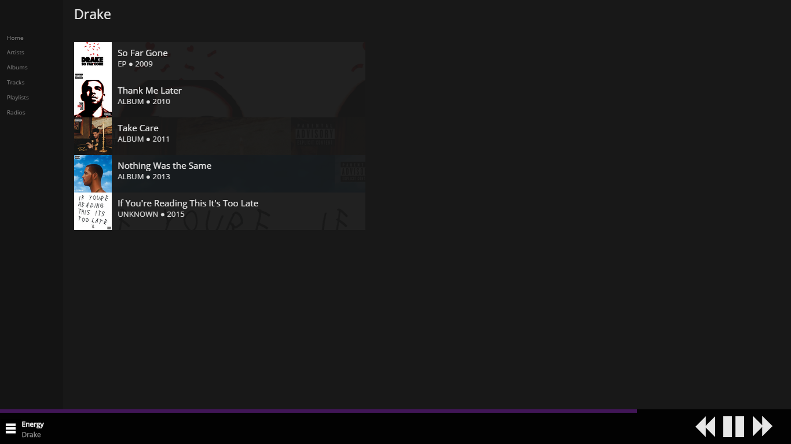

# mpwa
mpwa is a django powered music player web application you can use to stream your music to other devices on your network.

## Installation

Clone the project:

```sh
$ git clone https://github.com/lumib/mpwa
```

Install the dependencies in [requirements.txt](requirements.txt).

Change the SECRET_KEY ([you can generate one here](http://www.miniwebtool.com/django-secret-key-generator/)) in [mpwa/settings.py](mpwa/settings.py) and setup your database (makemigrations, migrate).

Copy/symlink your music to [music_player/static/music_player/music](music_player/static/music_player/music).

Run [music_player/tools/importer.py](music_player/tools/importer.py) to import your music to database.

You can then run the app using the django development server or your web server of choice.

## Screenshots




.
